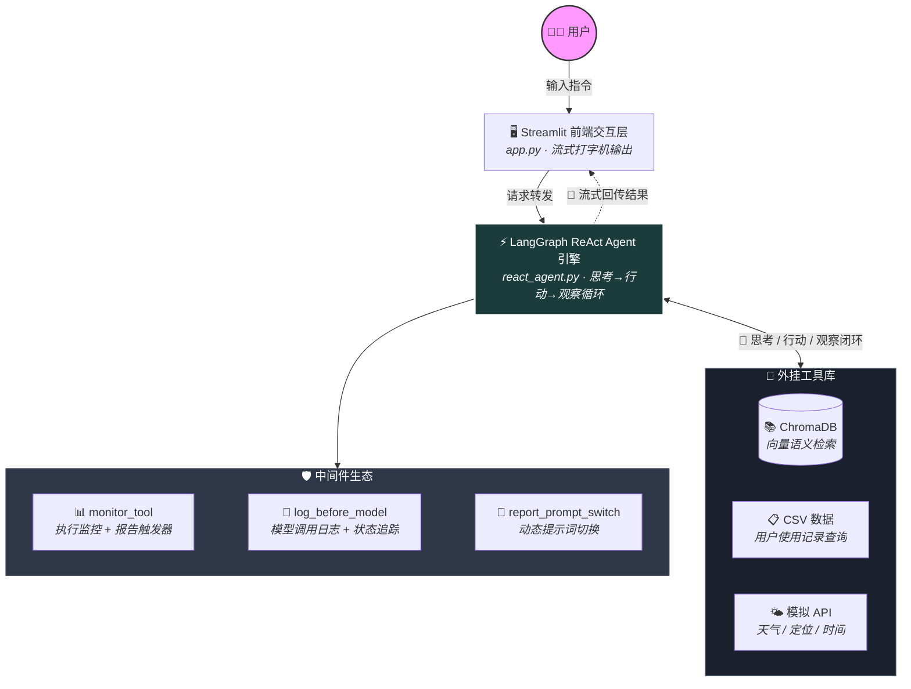
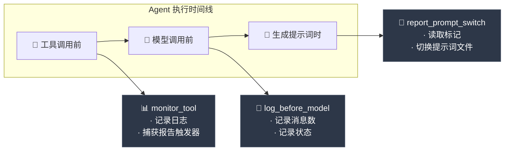
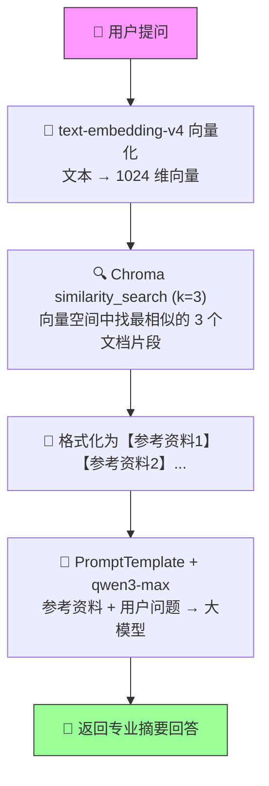
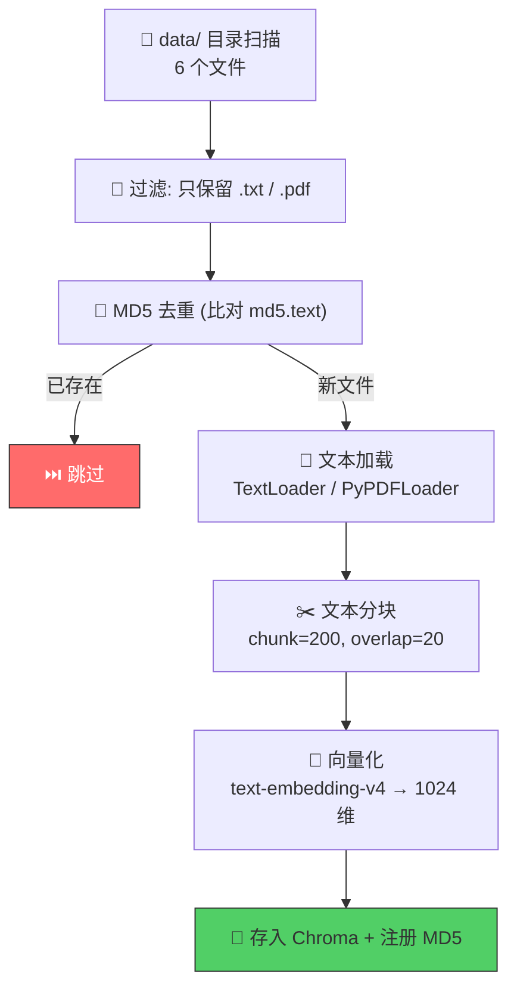

<div align="center">

# 🤖 扫地机器人智能客服 Agent

**基于 ReAct Agent + RAG + 通义千问构建的智能客服系统**

<p align="center">
  
  
  
  
  
  
  
</p>

> 这款智能客服 Agent 不仅仅是一个问答机器人，而是一个具备 **自主推理能力** 的 AI 智能体。
> 面对用户问题，它能自主完成 `思考` → `行动` → `观察` → `再思考` 的决策闭环，
> 按需调度外部工具，最终生成专业度极高的整合答复。

</div>

---

## 目录

- [核心痛点与解决思路](#-核心痛点与解决思路)
- [核心特性](#-核心特性)
- [系统架构](#️-系统架构)
- [效果展示](#-效果展示)
- [项目结构](#-项目结构)
- [快速开始（6步跑通）](#-快速开始6步跑通)
- [配置详解](#-配置详解)
- [两种运行模式](#-两种运行模式)
- [7个内置工具](#-7个内置工具)
- [核心设计解析](#-核心设计解析)
- [完整依赖清单](#-完整依赖清单)
- [常见问题排查](#-常见问题排查)
- [二次开发指南](#-二次开发指南)

---

## 🎯 核心痛点与解决思路

传统大模型客服存在两大致命问题：

| 痛点 | 表现 | 本项目的解法 |
|:----:|:-----|:------------|
| 🔴 **幻觉问题** | 大模型「一本正经地胡说八道」，编造不存在的产品信息 | RAG 知识库检索 — 基于真实文档回答，言之有据 |
| 🔴 **工具缺失** | 面对「查使用记录」「今天适不适合用扫地机」束手无策 | ReAct Agent — 自主决策调用外部工具 |
| 🔴 **模式单一** | 问答和报告生成需要两套系统 | 中间件动态切换 — 一套代码，两种模式无缝切换 |

---

## ✨ 核心特性

* 🧠 **ReAct 深度推理框架** — 依托 LangGraph 构建的图执行引擎，Agent 面对复杂问题能自主拆解、分步执行，告别「一步报错，全盘崩溃」。
* 📚 **高精准 RAG 知识库检索** — 内建 Chroma 本地向量数据库，结合 1024 维语义检索，从真实售后文档中提取依据，从根源消除大模型幻觉。
* ⚙️ **7 大内置智能工具** — 无缝集成知识检索、动态天气、用户画像分析、外部 CSV 查询及报告生成触发器，拓展业务边界。
* 🔄 **上下文感知与动态 Prompt** — 独创中间件拦截机制，无需重启即可根据会话上下文无缝切换「常规问答」与「深度报告生成」双模式。
* 🚀 **极客级架构设计** — 工厂模式 + 模块级单例，确保大模型与全局配置在极简资源消耗下保持最高响应速率；Streamlit 原生流式打字机输出，交互丝滑。

---

## 🏗️ 系统架构



### 技术栈矩阵

| 层级 | 技术选型 | 作用 |
|:----:|:--------:|:-----|
| 🧠 **大语言模型** | 通义千问 `qwen3-max` | 核心推理引擎，ReAct 思考与自然语言生成 |
| 🔢 **向量模型** | `text-embedding-v4` | 文本 → 1024 维向量，语义检索基础 |
| ⚡ **Agent 框架** | LangGraph + ReAct | 图执行引擎，支持循环推理和中间件拦截 |
| 🔗 **编排框架** | LangChain (LCEL) | Chain / Tool / Prompt 的标准抽象层 |
| 💾 **向量数据库** | Chroma | 本地持久化向量存储，零外部依赖 |
| 🖥️ **前端界面** | Streamlit | 快速搭建聊天 Web UI，原生流式支持 |
| 🔌 **模型 SDK** | DashScope | 阿里云模型调用底层接口 |

---

## 🎬 效果展示

### 💬 普通问答模式

```
┌────────────────────────────────────────────────────────────┐
│  👤 小户型适合哪些扫地机器人？                               │
├────────────────────────────────────────────────────────────┤
│  🤖 Agent：                                                │
│                                                            │
│  根据参考资料，小户型建议选择以下类型的扫地机器人：             │
│                                                            │
│  1. 📏 机身高度低于 8cm，可以轻松进入沙发和床底              │
│  2. 🗺️ 支持 LDS 激光导航，建图更精准                       │
│  3. 🗑️ 尘盒容量 0.3L 以上即可                              │
│  4. 💡 推荐关注科沃斯 DEEBOT 系列、石头 T 系列等            │
└────────────────────────────────────────────────────────────┘
```

### 📊 报告生成模式

```
┌────────────────────────────────────────────────────────────┐
│  👤 帮我生成我的使用报告                                     │
├────────────────────────────────────────────────────────────┤
│  🤖 Agent：                                                │
│                                                            │
│  # 📋 扫地机器人使用情况报告与保养建议                        │
│                                                            │
│  ## 一、基本信息                                            │
│  - 👤 用户ID：1003                                         │
│  - 📅 报告月份：2025-06                                    │
│                                                            │
│  ## 二、使用情况分析                                        │
│  - 📈 清洁效率：92%                                        │
│  - 🔧 耗材状态：边刷寿命剩余 60%                           │
│  - ⏱️ 使用频率：日均 2.3 次                                │
│                                                            │
│  ## 三、保养建议                                            │
│  1. 🔄 建议本月更换边刷                                    │
│  2. 🧹 尘盒滤网需要清洗                                    │
└────────────────────────────────────────────────────────────┘
```

---

## 📁 项目结构

```
.
├── 🚀 app.py                              # Streamlit 主入口
│
├── ⚙️ config/                             # 配置中心（YAML）
│   ├── rag.yml                            #   模型名称：qwen3-max / text-embedding-v4
│   ├── chroma.yml                         #   向量库参数：chunk_size=200, k=3
│   ├── prompts.yml                        #   提示词路径映射
│   └── agent.yml                          #   外部数据路径
│
├── 💬 prompts/                            # 提示词模板（纯文本）
│   ├── main_prompt.txt                    #   普通客服 ReAct 系统提示词
│   ├── report_prompt.txt                  #   报告生成专用提示词（强制工具链）
│   └── rag_summarize.txt                  #   RAG 摘要提示词
│
├── 🤖 agent/                              # Agent 核心
│   ├── react_agent.py                     #     ReactAgent 类：create_agent() + execute_stream()
│   └── tools/
│       ├── agent_tools.py                 #       7 个 @tool 工具定义
│       └── middleware.py                  #       3 个中间件（监控/日志/提示切换）
│
├── 🔍 rag/                                # RAG 检索模块
│   ├── rag_service.py                     #     检索 + LCEL 摘要链
│   └── vector_store.py                    #     Chroma 管理 + 文档 ETL
│
├── 🏭 model/
│   └── factory.py                         # 模型工厂（单例模式）
│
├── 🛠️ utils/                              # 工具层
│   ├── config_handler.py                  #   YAML 配置加载器（模块级单例）
│   ├── prompt_loader.py                   #   提示词文件加载
│   ├── file_handler.py                    #   MD5 去重 + PDF/TXT 加载器
│   ├── logger_handler.py                  #   控制台 + 文件双通道日志
│   └── path_tool.py                       #   相对路径 → 绝对路径
│
├── 📚 data/                               # 知识库文档
│   ├── 扫地机器人100问.pdf / .txt          #   常见问题
│   ├── 扫拖一体机器人100问.txt             #   扫拖一体 FAQ
│   ├── 故障排除.txt                        #   故障排查指南
│   ├── 维护保养.txt                        #   日常维护
│   ├── 选购指南.txt                        #   选购建议
│   └── external/records.csv               #   模拟用户使用记录（10用户×12月）
│
├── 📄 md5.text                            # 已入库文档 MD5 注册表
├── 📋 requirements.txt                    # Python 依赖
├── 🔐 .env.example                        # 环境变量模板
└── 🚫 .gitignore
```

---

## 🚀 快速开始（6步跑通）

> ⚠️ **重要：所有命令都在项目根目录下执行，不要进入子目录。**

### Step 1 · 克隆项目

```bash
git clone https://github.com/xxdrziansnje/-Agent-.git
cd -Agent-
```

### Step 2 · 创建虚拟环境

```bash
python -m venv venv
```

激活虚拟环境：

```bash
# Windows CMD
venv\Scripts\activate.bat

# Windows PowerShell
venv\Scripts\Activate.ps1

# macOS / Linux
source venv/bin/activate
```

激活后命令行前面会出现 `(venv)` 前缀。

> 💡 **为什么用虚拟环境？**
> 不同项目可能依赖同一个包的不同版本。虚拟环境为每个项目创建独立的 Python 环境，
> 避免 A 项目需要 `langchain==0.3.0` 而 B 项目需要 `langchain==0.2.0` 的冲突。

### Step 3 · 安装依赖

```bash
pip install -r requirements.txt
```

> 🚀 **下载很慢？** 使用国内镜像源：
> ```bash
> pip install -r requirements.txt -i https://pypi.tuna.tsinghua.edu.cn/simple
> ```

### Step 4 · 配置 API Key

#### 🔑 4.1 为什么需要 API Key？

本项目使用阿里云的 **通义千问 (qwen3-max)** 大模型和 **text-embedding-v4** 向量模型。
调用这些模型需要通过 DashScope 平台进行身份验证。

简单来说：
- **API Key = 你的身份凭证**，阿里云用它来识别「谁在调用模型」
- **每次调用会消耗 Token**（按量计费），API Key 决定了从哪个账号扣费
- **没有 API Key 就无法调用模型**，程序启动就会报错

#### 📝 4.2 获取 API Key（约 2 分钟）

1. 打开 [阿里云 DashScope 控制台](https://dashscope.console.aliyun.com/)
2. 用你的阿里云账号登录（没有就注册一个，**免费**）
3. 首次使用需要**开通 DashScope 服务**（免费开通，按量计费）
4. 左侧菜单 → **「API-KEY 管理」** → **「创建新的 API-KEY」**
5. 复制生成的 Key（格式类似 `sk-xxxxxxxxxxxxxxxxxxxxxxxx`）

#### ✏️ 4.3 写入配置文件

```bash
# Windows PowerShell
Copy-Item .env.example .env

# macOS / Linux
cp .env.example .env
```

然后编辑 `.env`，填入你的 Key：

```env
DASHSCOPE_API_KEY=sk-你的实际Key填在这里
```

> 🔒 **安全提醒：**
> - `.env` 文件已在 `.gitignore` 中，**不会被提交到 GitHub**
> - **千万不要**把 API Key 直接写在代码里或提交到公开仓库
> - 如果 Key 不慎泄露，去 DashScope 控制台删除并重新创建即可

#### 🌐 4.4 关于 Base_URL

本项目使用阿里云官方 SDK，**默认连接 DashScope 官方接口**，**不需要配置 base_url**。

如果你使用的是**第三方兼容接口**（公司内部代理、OpenAI 兼容网关），需要修改 `model/factory.py`：

```python
from langchain_openai import ChatOpenAI

class ChatModelFactory(BaseModelFactory):
    def generator(self):
        return ChatOpenAI(
            model="qwen3-max",
            api_key="your-key",
            base_url="https://your-proxy-url/v1",
        )
```

> 💡 **大多数人不需要改这个。** 直接用阿里云官方接口即可。

### Step 5 · 初始化知识库

```bash
python -m rag.vector_store
```

首次运行输出：

```
INFO - [加载知识库] data\扫地机器人100问.pdf 内容加载成功
INFO - [加载知识库] data\扫拖一体机器人100问.txt 内容加载成功
INFO - [加载知识库] data\故障排除.txt 内容加载成功
...
```

> 💡 **为什么用 `python -m` 而不是 `python rag/vector_store.py`？**
> 项目内部使用了相对导入（如 `from utils.xxx import ...`），
> 直接运行 `.py` 文件会报 `ModuleNotFoundError`。
> `python -m` 会把项目根目录加入 Python 搜索路径，确保模块正确导入。

> 📦 **这一步做了什么？**
>
> | 步骤 | 操作 | 说明 |
> |:----:|:-----|:-----|
> | 1️⃣ | 扫描 `data/` 目录 | 找到所有 `.txt` 和 `.pdf` 文件 |
> | 2️⃣ | MD5 去重 | 对每个文件计算 MD5，跳过已入库的 |
> | 3️⃣ | 文本分块 | 按 200 字符切块，重叠 20 字符 |
> | 4️⃣ | 向量化 | 调用 `text-embedding-v4` 转为 1024 维向量 |
> | 5️⃣ | 存入 Chroma | 写入本地向量数据库 |
>
> 首次运行会消耗少量 Token。后续运行如果文档没变化会自动跳过。

### Step 6 · 启动应用

```bash
streamlit run app.py
```

浏览器自动打开 `http://localhost:8501`，即可开始对话。

> ✅ **看到以下输出说明一切正常：**
> ```
> You can now view your Streamlit app in your browser.
> Local URL: http://localhost:8501
> ```

---

## ⚙️ 配置详解

所有运行时配置集中在 `config/` 目录下的 YAML 文件中，**无需修改 Python 代码**。

### 🧠 config/rag.yml — 模型配置

```yaml
chat_model_name: qwen3-max              # 聊天大模型
embedding_model_name: text-embedding-v4  # 向量嵌入模型
```

可选模型（按速度排序）：

| 模型 | ⚡ 速度 | 🎯 质量 | 📋 适用场景 |
|:----:|:-------:|:-------:|:-----------|
| `qwen-turbo` | 🟢 最快 | ⭐⭐ | 简单问答、开发测试 |
| `qwen-plus` | 🟡 中等 | ⭐⭐⭐ | 日常使用 |
| `qwen3-max` | 🔴 较慢 | ⭐⭐⭐⭐⭐ | 复杂推理、报告生成（默认） |

### 💾 config/chroma.yml — 向量数据库配置

```yaml
collection_name: agent           # Chroma 集合名
persist_directory: chroma_db     # 持久化目录
k: 3                             # 检索返回的 Top-K 文档数
chunk_size: 200                  # 文本分块大小（字符数）
chunk_overlap: 20                # 分块重叠长度
```

> 💡 **chunk_size 怎么选？**
> - `<100`：语义被切断，检索效果差
> - `200-500`：推荐范围
> - `>500`：包含太多无关信息，模型容易「迷路」

### 💬 config/prompts.yml — 提示词路径

```yaml
main_prompt_path: prompts/main_prompt.txt
rag_summarize_prompt_path: prompts/rag_summarize.txt
report_prompt_path: prompts/report_prompt.txt
```

---

## 🔄 两种运行模式

### 💬 普通问答模式

直接输入问题，Agent 走标准 ReAct 流程：

```
👤 小户型适合哪些扫地机器人？

🧠 Agent 思考：用户在问选购建议，需要调用 rag_summarize 检索知识库
🔧 Agent 行动：调用 rag_summarize("小户型 扫地机器人 推荐")
👀 Agent 观察：检索到 3 条参考资料
💬 Agent 回答：根据参考资料，小户型建议选择...
```

### 📊 报告生成模式

输入包含「报告」「使用记录」等关键词时，Agent 自动切换模式：

```
👤 帮我生成我的使用报告

🧠 Agent 思考：用户要生成报告，需要按固定流程执行
🔧 Agent 行动：调用 get_user_id()          → 获取 "1003"
🔧 Agent 行动：调用 get_current_month()     → 获取 "2025-06"
🔧 Agent 行动：调用 fill_context_for_report() → 触发中间件切换提示词
🔧 Agent 行动：调用 fetch_external_data()   → 获取使用数据
💬 Agent 回答：# 📋 扫地机器人使用情况报告...
```

> 💡 **提示词切换机制（关键设计）：**
>
> `fill_context_for_report` 工具本身没有业务逻辑，它的唯一作用是：
> 1. 被 `monitor_tool` 中间件捕获
> 2. 中间件将运行时上下文标记为 `report=True`
> 3. `report_prompt_switch` 中间件读取该标记
> 4. 自动切换到报告专用提示词文件
>
> 这是一个**解耦设计** —— 工具只负责「触发信号」，提示词切换由中间件负责。

---

## 🔧 7个内置工具

| # | 工具名 | 类型 | 说明 | 入参 |
|:-:|:-------|:----:|:-----|:-----|
| 1 | 📚 `rag_summarize` | 真实 RAG | Chroma 检索 → LLM 摘要 | `query: str` |
| 2 | 🌤️ `get_weather` | 模拟 | 返回指定城市天气 | `city: str` |
| 3 | 📍 `get_user_location` | 模拟 | 返回用户所在城市 | 无 |
| 4 | 👤 `get_user_id` | 模拟 | 返回用户 ID | 无 |
| 5 | 📅 `get_current_month` | 模拟 | 返回当前月份 (YYYY-MM) | 无 |
| 6 | 📋 `fetch_external_data` | 真实文件 | CSV 查询用户使用记录 | `user_id, month` |
| 7 | 🔀 `fill_context_for_report` | 触发器 | 触发中间件切换报告模式 | 无 |

> 💡 **关于「模拟」工具：** `get_weather` 等返回的是模拟数据。
> 实际项目中只需替换函数体为真实 API 调用，Agent 层无需任何改动。

---

## 🧩 核心设计解析

### 🛡️ 中间件架构



### 🔍 RAG 检索链路



### 📦 文档 ETL 流程



---

## 📦 完整依赖清单

| 包名 | 用途 |
|:-----|:-----|
| `langchain` | LLM 应用开发框架（Agent / Chain / Tool） |
| `langchain-core` | 核心组件（LCEL / 消息类型 / Prompt） |
| `langchain-community` | 社区集成（ChatTongyi / DashScopeEmbeddings） |
| `langchain-chroma` | Chroma 向量数据库集成 |
| `langchain-text-splitters` | 文本分块器 |
| `langgraph` | 图执行引擎（ReAct 循环 + 中间件） |
| `dashscope` | 阿里云 DashScope SDK |
| `streamlit` | Web UI 框架 |
| `pypdf` | PDF 文件解析器 |
| `pyyaml` | YAML 配置解析 |
| `python-dotenv` | `.env` 环境变量加载 |

> 📥 **安装：** `pip install -r requirements.txt`
>
> 🚀 **镜像加速：** `pip install -r requirements.txt -i https://pypi.tuna.tsinghua.edu.cn/simple`

---

## 🐛 常见问题排查

<details>
<summary><b>❌ ModuleNotFoundError: No module named 'xxx'</b></summary>

确保在**项目根目录**下运行，且使用 `python -m` 方式：

```bash
# ✅ 正确
python -m rag.vector_store

# ❌ 错误
python rag/vector_store.py
```

</details>

<details>
<summary><b>🔑 DashScope API Key 相关错误</b></summary>

检查清单：
1. `.env` 文件存在于项目根目录（不是子目录）
2. 文件名正确（不要写成 `.env.txt`）
3. Key 前缀是 `sk-`，等号两边没有空格
4. 刚创建 `.env` 后重启终端再试

**快速验证：**

```bash
python -c "from dotenv import load_dotenv; load_dotenv(); from model.factory import chat_model; print(chat_model.invoke('你好').content)"
```

</details>

<details>
<summary><b>📚 知识库初始化报错</b></summary>

1. 确保 `data/` 目录下有 `.txt` 或 `.pdf` 文件
2. 确保安装了 `pypdf`：`pip install pypdf`
3. 使用 `python -m rag.vector_store` 命令

</details>

<details>
<summary><b>💾 Chroma 数据库报错</b></summary>

删除数据库后重新初始化：

```bash
# Windows
rmdir /s /q chroma_db

# macOS / Linux
rm -rf chroma_db

python -m rag.vector_store
```

</details>

<details>
<summary><b>🐢 模型响应很慢</b></summary>

修改 `config/rag.yml` 中的 `chat_model_name`：

```yaml
chat_model_name: qwen-turbo   # 🟢 最快
# chat_model_name: qwen-plus  # 🟡 平衡
# chat_model_name: qwen3-max  # 🔴 最强（默认）
```

</details>

<details>
<summary><b>🐢 首次启动很慢</b></summary>

首次启动会下载 sentence-transformers 模型（约 500MB）。后续启动会快很多。

</details>

---

## 🛠️ 二次开发指南

### ➕ 添加新工具

在 `agent/tools/agent_tools.py` 中：

```python
@tool(description="工具描述，Agent 根据此判断何时调用")
def my_new_tool(param: str) -> str:
    # 你的逻辑
    return "结果"
```

在 `agent/react_agent.py` 中注册：

```python
tools=[rag_summarize, get_weather, ..., my_new_tool]
```

在 `prompts/main_prompt.txt` 中补充工具使用说明。

### ➕ 添加新中间件

在 `agent/tools/middleware.py` 中：

```python
@wrap_tool_call  # 或 @before_model / @dynamic_prompt
def my_middleware(request, handler):
    # 拦截逻辑
    return handler(request)
```

在 `agent/react_agent.py` 中注册：

```python
middleware=[monitor_tool, ..., my_middleware]
```

### 🔄 替换大模型

修改 `config/rag.yml` 中的模型名称即可，无需改代码。
如果要换成非阿里云模型，需修改 `model/factory.py` 中的工厂类。

---

<div align="center">

**如果这个项目对你有帮助，请给一个 ⭐ Star 支持一下！**


</div>
